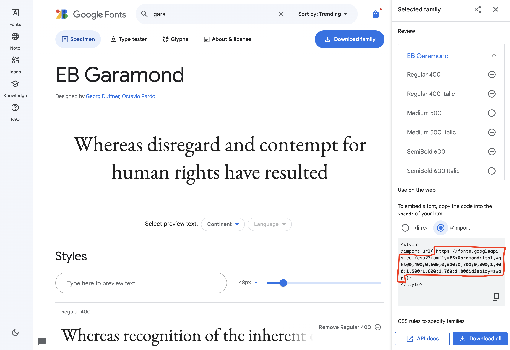

## What does this acheive??

It's similiar to [font-ranger](https://www.npmjs.com/package/font-ranger?activeTab=readme); it splits the desired font into subsets for faster loading.

## What are the obstacles??

[Google Fonts](https://fonts.google.com/) Is the best provider of highly optimized `woff2` fonts split into subsets for different languages and/or scripts. The problem is that if you are looking to host your fonts on your own, it is a MASSIVELY grindy task to optimize the fonts and manage the subsets of the fonts yourself. Unfortunately, Google only lets you download THE entirety of the font in a subpar format (`ttf`). If you want the benefits of `woff2` and type subsets, you need to use their CDN.

## How does it work??

This spins up a webapp in headless browser through Puppeteer to intercept
the font request responses and write the font-assets to the file system, essentially downloading them.

Google utilises the [unicode-range](https://developer.mozilla.org/en-US/docs/Web/CSS/@font-face/unicode-range) descriptor of the CSS font-face rule. Google will only load parts of the font where the webpage contents include a unicode symbol that matches the specified unicode-range.

The clever part of this solution is that it parses the font-face rules returned by google and outputs to the webapp all the found unicode-ranges to spawn *all* the possible requests for a font. Because google's font asset CDN links are cryptic and not unique for each subset, there's some content negotiation between the client ann cdn that determine what variation of the font the client is requesting, to better identify what font is requested, the client-app also assigns some URL params to the 
font-requests for easier handling in the download-phase.

## How to use??

Run `$ npm run fonts:download <google-font-face-styles-url>`.

The command requires an URL argument pointing to a google font-face style document. The font face stylesheet url can be found when browsing and selecting fonts on the google fonts webpage. See example below

Source example

## Misc notes

- The duration of the font-downloading is very variable depending on the quantity of fonts, I don't care to track the progress to make the script exit on its own. Just keep an eye on the terminal output/terminal and terminate the script yourself when happy w/ the result

- This app is very brittle and probably very prone to breaking should google structure their response data differently. This was last successfylly tested in Jan 2024

